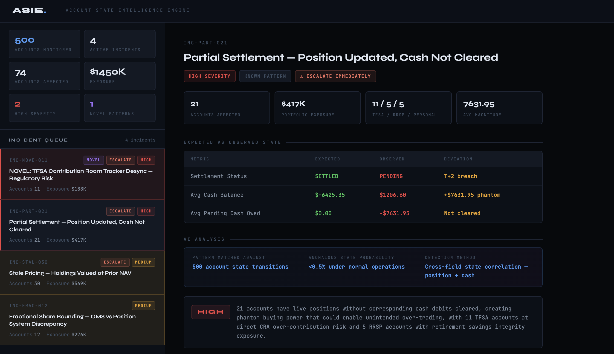
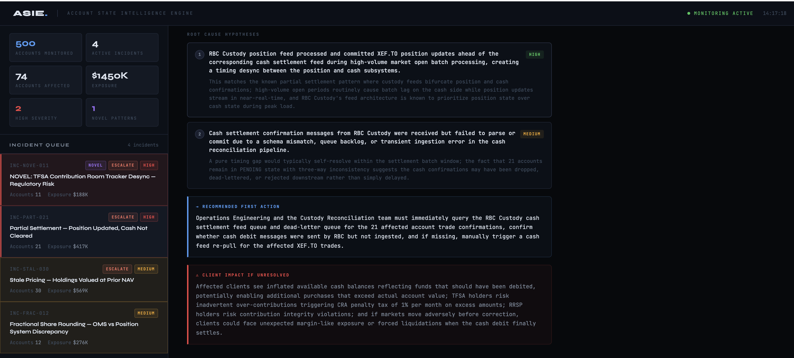
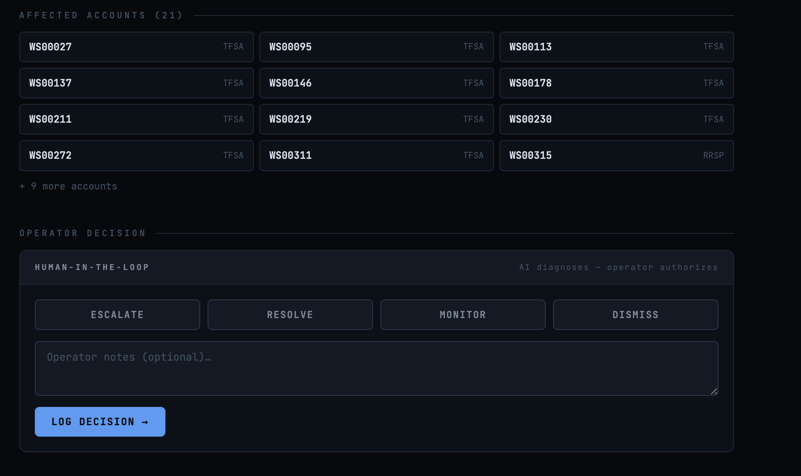

# ASIE Account State Intelligence Engine

AI powered cross system account state monitoring architecture combining deterministic controls, probabilistic anomaly scoring, and structured AI reasoning for financial operations intelligence.

---

## Overview

ASIE is a monitoring architecture designed to detect systemic failures across distributed financial systems before downstream impact materializes.

Modern financial platforms rely on loosely coupled services including ledger systems, settlement engines, position management, eligibility trackers, and compliance services. Each component may function correctly in isolation while the joint state across systems becomes inconsistent.

Traditional monitoring approaches are rule based. They validate individual fields or threshold breaches. They do not model cross system state relationships or statistical rarity across combined dimensions.

ASIE addresses this gap by layering probabilistic state modeling and AI assisted reasoning on top of deterministic controls.

---

## Core Principle

Individual validation does not guarantee systemic integrity.

A system can exhibit:

- Valid cash balances  
- Valid transaction logs  
- Valid position reconciliation  
- Valid service level health  

Yet still exist in a statistically implausible joint configuration.

ASIE detects improbable joint states rather than isolated field failures.

---

## Architecture

ASIE consists of three coordinated layers.

### 1. Deterministic Rule Layer

Handles known and explicitly defined failure modes.

This layer remains fast, reliable, and production safe. It is not replaced.

### 2. Probabilistic State Layer

Learns normal account state transitions and joint distributions.

Prototype methods include:

- Z score based deviation detection for continuous variables  
- Joint multivariate anomaly scoring  
- Correlation based clustering across accounts  

In a production environment this layer would compute rolling distribution statistics over meaningful historical windows and continuously recalibrate.

The objective is early detection of statistically rare state configurations before explicit rules exist.

### 3. Structured AI Reasoning Layer

Transforms detected anomalies into operationally actionable outputs.

This layer produces:

- Ranked root cause hypotheses  
- Confidence estimates  
- Severity classification  
- Exposure estimation  
- Suggested first actions  
- Structured audit logs  

The system generates reasoning artifacts that are inspectable and reviewable.

ASIE diagnoses but does not execute.  
Remediation requires explicit human authorization.

---

## Detection Philosophy

The probabilistic layer is designed to capture three categories of failure:

1. Known deterministic violations  
2. Statistically rare single variable deviations  
3. Joint multivariate inconsistencies that are individually plausible but collectively anomalous  

This allows the system to surface novel systemic failure modes on first occurrence.

---

## Pipeline

1. Generate or ingest account state data  
2. Detect anomalies using probabilistic scoring  
3. Cluster correlated incidents  
4. Generate AI structured explanations  
5. Rank incidents by severity and exposure  
6. Present results in triage dashboard  
7. Log operator decisions to an audit trail  

The full detection and reasoning pipeline executes automatically.

---

## Prototype Demonstration

The prototype runs against synthetic brokerage style accounts and simulates distributed system desynchronization scenarios.

Results demonstrate:

- Automated anomaly detection  
- Cross account clustering  
- Structured AI generated root cause analysis  
- Audit logging of human decisions  

Statistical modeling currently uses synthetic distributions for demonstration purposes.

---

## Prototype Interface

### Dashboard Overview



### Incident Detail View



### Operator Decision Panel



---

## Scalability Considerations

Production deployment requires attention to:

- Historical data sufficiency for stable distribution modeling  
- False positive management and alert fatigue mitigation  
- Latency constraints of AI reasoning under stress conditions  
- Clear governance boundaries between model output and human authority  

A production architecture would tier reasoning priority based on exposure and risk class.

---

## Operational Impact

ASIE enables:

- Detection of novel systemic failures  
- Reduction of analyst investigation time  
- Centralization of institutional reasoning  
- Structured auditability of operational decisions  
- Monitoring across millions of accounts without linear staffing growth  

The cognitive burden shifts from detection to judgment.

---

## Repository Structure

```
ai/            AI reasoning layer
api/           Backend services
clustering/    Incident clustering logic
data/          Synthetic data generation
detection/     Anomaly detection models
frontend/      Dashboard interface
logs/          Audit outputs
```

---

## Status

This repository contains a working architectural prototype demonstrating detection, clustering, reasoning, and audit functionality.

Designed as a foundation for production scale financial infrastructure monitoring.
